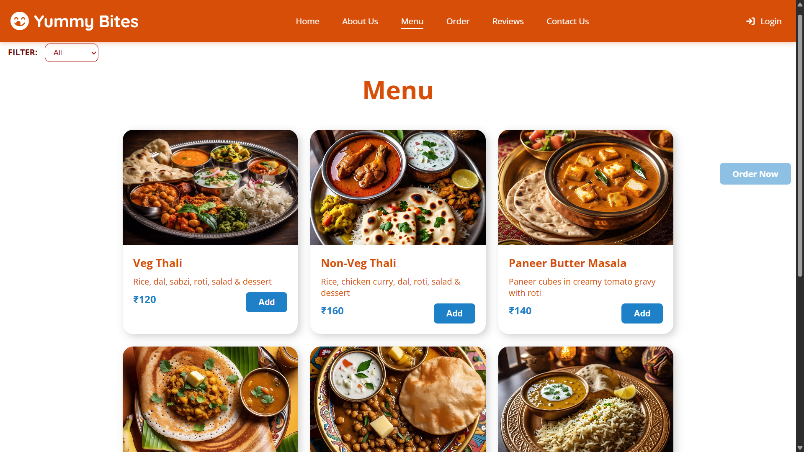
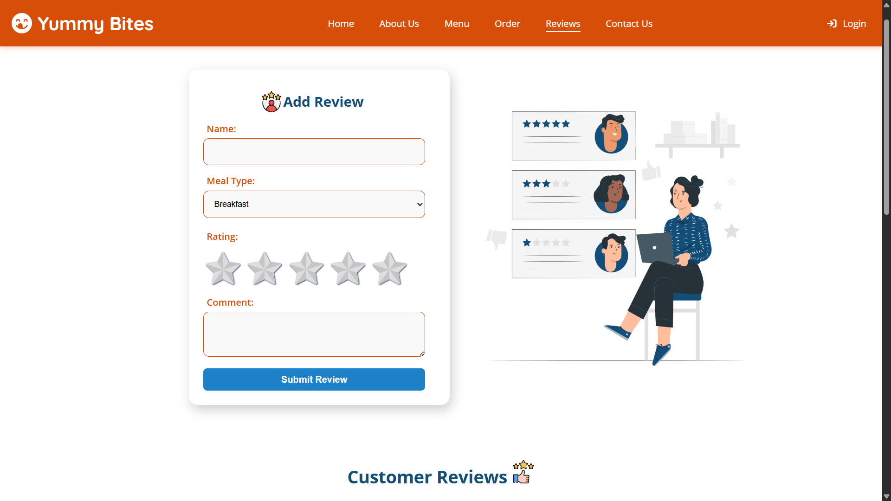

# 😋 Yummy Bites

**Live Preview**: [Yummy Bites on Vercel](https://icp-11-javascript-github-project-yu.vercel.app)

Welcome to **Yummy Bites** — a responsive and interactive food ordering website built using **HTML**, **CSS**, and **JavaScript**. This project showcases a complete restaurant menu, a functional cart system, and local storage integration.

---

## 🧾 Features

- 🍱 Interactive menu with category filtering (Veg / Non-Veg / All)
- 🛒 Add to Cart & Remove from Cart functionality
- 🧮 Dynamic price calculation
- 💾 Cart data stored in **Local Storage** (persists on page reload)
- 📱 Fully responsive design for mobile and desktop
- 🔍 Scroll-to-top button and clean navigation

## 🛠️ Tech Stack

- **HTML5**
- **CSS3**
- **JavaScript**
- **Local Storage**
- **Vercel** for deployment

## Contributors:

## Contact:

For any questions or feedback, please contact:

**Ravikant Tarare**

📩 [ravikanttarare2001@gmail.com](mailto:ravikanttarare2001@gmail.com)

📞 [8275957698](tel:8275957698)
